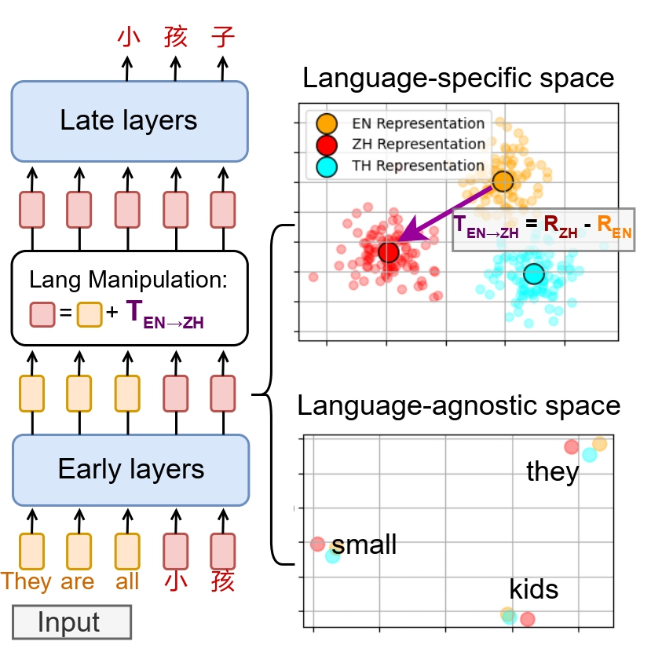
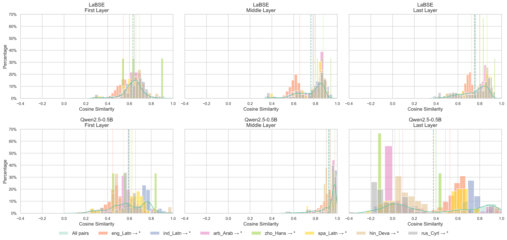

# Inference-Time Language Control (ITLC)

Inference-Time Language Control (ITLC) is a novel method designed to enhance cross-lingual language control and mitigate language confusion in Large Language Models (LLMs) that is introduced in ["Language Surgery in Multilingual Large Language Models"](https://aclanthology.org/2025.mrl-main.30/). ITLC leverages latent injection to enable precise manipulation of language-specific information during inference, while preserving semantic integrity.

<p align="center">
  
</p>

ITLC addresses the challenge of language confusion in LLMs, which can lead to inconsistent language generation. By exploiting naturally emerging representation alignment in the middle layers of LLMs, ITLC disentangles language-specific and language-agnostic information. This allows for effective control over the generated language without compromising semantic meaning.

The key contributions of ITLC and the corresponding ["Language Surgery in Multilingual Large Language Models"](https://aclanthology.org/2025.mrl-main.30/) paper include:
- Confirming the presence of representation alignment in LLMs and analyzing its behavior:
  
- Demonstrating a method to extract and manipulate language-specific information.
- Introducing a practical solution for cross-lingual language control and language confusion mitigation.

The method has been experimentally validated, showing strong cross-lingual control capabilities and effectiveness in reducing language confusion. ITLC is open-source, providing a valuable tool for improving the multilingual performance of LLMs.

## Getting Started

To use ITLC, follow these steps:

1. **Installation**: Clone the repository and install dependencies.
2. **Data Preparation**: Prepare your dataset in the required format.
3. **Model Setup**: Configure the model and ITLC parameters.
4. **Inference**: Run the ITLC method on your data.

### Installation

To install ITLC, follow these steps:

1. Clone the repository: `git clone https://github.com/SEACrowd/itlc.git`
2. move to itlc directory: `cd itlc`
3. Install the required dependencies: `pip install -v -e .`
   
> [!IMPORTANT]
> This repository is built on `transformers==4.43.0`. Using newer versions of the transformers library may cause compatibility issues or break the code.

### Usage

#### Quickstart
ITLC can be used to control the language of generated text in LLMs. Here's an example of how to use ITLC to generate text in a specific language, We have provided the LDA model weights and language vectors in `.pkl` format, extracted from FLORES-200 using Qwen2.5-0.5B: 
```python
from itlc import ITLC
from transformers import AutoModelForCausalLM, AutoTokenizer

# load model
model_name = "Qwen/Qwen2.5-0.5B"
tokenizer = AutoTokenizer.from_pretrained(model_name, trust_remote_code=True, padding_side="left")
model = AutoModelForCausalLM.from_pretrained(
        model_name,
        device_map="auto",
    )

# Initialize the ITLC model
itlc = ITLC(model=model, tokenizer=tokenizer, lda_model_path = "./lda_model.pkl", langvec_path = "./langvec.pkl")

src_id = 48 #en
tgt_id = 80 #ja

# Generate text in the target language
generated_text = itlc.generate(prompt=['Hello, how are you?'], src_id=src_id, tgt_id=tgt_id)

print(generated_text)
```

<details>
<summary>Following are the corresponding <code>language ID</code> list from the provieded <code>langvec.pkl:</code></summary>

```python
lang_code = {
    "ace_Arab": 0,
    "ace_Latn": 1,
    "acm_Arab": 2,
    "acq_Arab": 3,
    "aeb_Arab": 4,
    "afr_Latn": 5,
    "ajp_Arab": 6,
    "aka_Latn": 7,
    "als_Latn": 8,
    "amh_Ethi": 9,
    "apc_Arab": 10,
    "arb_Arab": 11,
    "arb_Latn": 12,
    "ars_Arab": 13,
    "ary_Arab": 14,
    "arz_Arab": 15,
    "asm_Beng": 16,
    "ast_Latn": 17,
    "awa_Deva": 18,
    "ayr_Latn": 19,
    "azb_Arab": 20,
    "azj_Latn": 21,
    "bak_Cyrl": 22,
    "bam_Latn": 23,
    "ban_Latn": 24,
    "bel_Cyrl": 25,
    "bem_Latn": 26,
    "ben_Beng": 27,
    "bho_Deva": 28,
    "bjn_Arab": 29,
    "bjn_Latn": 30,
    "bod_Tibt": 31,
    "bos_Latn": 32,
    "bug_Latn": 33,
    "bul_Cyrl": 34,
    "cat_Latn": 35,
    "ceb_Latn": 36,
    "ces_Latn": 37,
    "cjk_Latn": 38,
    "ckb_Arab": 39,
    "crh_Latn": 40,
    "cym_Latn": 41,
    "dan_Latn": 42,
    "deu_Latn": 43,
    "dik_Latn": 44,
    "dyu_Latn": 45,
    "dzo_Tibt": 46,
    "ell_Grek": 47,
    "eng_Latn": 48,
    "epo_Latn": 49,
    "est_Latn": 50,
    "eus_Latn": 51,
    "ewe_Latn": 52,
    "fao_Latn": 53,
    "fij_Latn": 54,
    "fin_Latn": 55,
    "fon_Latn": 56,
    "fra_Latn": 57,
    "fur_Latn": 58,
    "fuv_Latn": 59,
    "gaz_Latn": 60,
    "gla_Latn": 61,
    "gle_Latn": 62,
    "glg_Latn": 63,
    "grn_Latn": 64,
    "guj_Gujr": 65,
    "hat_Latn": 66,
    "hau_Latn": 67,
    "heb_Hebr": 68,
    "hin_Deva": 69,
    "hne_Deva": 70,
    "hrv_Latn": 71,
    "hun_Latn": 72,
    "hye_Armn": 73,
    "ibo_Latn": 74,
    "ilo_Latn": 75,
    "ind_Latn": 76,
    "isl_Latn": 77,
    "ita_Latn": 78,
    "jav_Latn": 79,
    "jpn_Jpan": 80,
    "kab_Latn": 81,
    "kac_Latn": 82,
    "kam_Latn": 83,
    "kan_Knda": 84,
    "kas_Arab": 85,
    "kas_Deva": 86,
    "kat_Geor": 87,
    "kaz_Cyrl": 88,
    "kbp_Latn": 89,
    "kea_Latn": 90,
    "khk_Cyrl": 91,
    "khm_Khmr": 92,
    "kik_Latn": 93,
    "kin_Latn": 94,
    "kir_Cyrl": 95,
    "kmb_Latn": 96,
    "kmr_Latn": 97,
    "knc_Arab": 98,
    "knc_Latn": 99,
    "kon_Latn": 100,
    "kor_Hang": 101,
    "lao_Laoo": 102,
    "lij_Latn": 103,
    "lim_Latn": 104,
    "lin_Latn": 105,
    "lit_Latn": 106,
    "lmo_Latn": 107,
    "ltg_Latn": 108,
    "ltz_Latn": 109,
    "lua_Latn": 110,
    "lug_Latn": 111,
    "luo_Latn": 112,
    "lus_Latn": 113,
    "lvs_Latn": 114,
    "mag_Deva": 115,
    "mai_Deva": 116,
    "mal_Mlym": 117,
    "mar_Deva": 118,
    "min_Arab": 119,
    "min_Latn": 120,
    "mkd_Cyrl": 121,
    "mlt_Latn": 122,
    "mni_Beng": 123,
    "mos_Latn": 124,
    "mri_Latn": 125,
    "mya_Mymr": 126,
    "nld_Latn": 127,
    "nno_Latn": 128,
    "nob_Latn": 129,
    "npi_Deva": 130,
    "nso_Latn": 131,
    "nus_Latn": 132,
    "nya_Latn": 133,
    "oci_Latn": 134,
    "ory_Orya": 135,
    "pag_Latn": 136,
    "pan_Guru": 137,
    "pap_Latn": 138,
    "pbt_Arab": 139,
    "pes_Arab": 140,
    "plt_Latn": 141,
    "pol_Latn": 142,
    "por_Latn": 143,
    "prs_Arab": 144,
    "quy_Latn": 145,
    "ron_Latn": 146,
    "run_Latn": 147,
    "rus_Cyrl": 148,
    "sag_Latn": 149,
    "san_Deva": 150,
    "sat_Olck": 151,
    "scn_Latn": 152,
    "shn_Mymr": 153,
    "sin_Sinh": 154,
    "slk_Latn": 155,
    "slv_Latn": 156,
    "smo_Latn": 157,
    "sna_Latn": 158,
    "snd_Arab": 159,
    "som_Latn": 160,
    "sot_Latn": 161,
    "spa_Latn": 162,
    "srd_Latn": 163,
    "srp_Cyrl": 164,
    "ssw_Latn": 165,
    "sun_Latn": 166,
    "swe_Latn": 167,
    "swh_Latn": 168,
    "szl_Latn": 169,
    "tam_Taml": 170,
    "taq_Latn": 171,
    "taq_Tfng": 172,
    "tat_Cyrl": 173,
    "tel_Telu": 174,
    "tgk_Cyrl": 175,
    "tgl_Latn": 176,
    "tha_Thai": 177,
    "tir_Ethi": 178,
    "tpi_Latn": 179,
    "tsn_Latn": 180,
    "tso_Latn": 181,
    "tuk_Latn": 182,
    "tum_Latn": 183,
    "tur_Latn": 184,
    "twi_Latn": 185,
    "tzm_Tfng": 186,
    "uig_Arab": 187,
    "ukr_Cyrl": 188,
    "umb_Latn": 189,
    "urd_Arab": 190,
    "uzn_Latn": 191,
    "vec_Latn": 192,
    "vie_Latn": 193,
    "war_Latn": 194,
    "wol_Latn": 195,
    "xho_Latn": 196,
    "ydd_Hebr": 197,
    "yor_Latn": 198,
    "yue_Hant": 199,
    "zho_Hans": 200,
    "zho_Hant": 201,
    "zsm_Latn": 202,
    "zul_Latn": 203,
}
```

</details>

#### Using Custom Dataset:
The dataset should consist of parallel sentences, where each row contains aligned translations and each column represents a different language. Follow the steps below to extract embeddings and train the LDA model:
```python
from itlc import ITLC
from transformers import AutoModelForCausalLM, AutoTokenizer
from datasets import load_dataset
from sklearn.model_selection import train_test_split

# Step 1: Load model
model_name = "Qwen/Qwen2.5-0.5B"
tokenizer = AutoTokenizer.from_pretrained(model_name, trust_remote_code=True, padding_side="left")
model = AutoModelForCausalLM.from_pretrained(
        model_name,
        device_map="auto",
    )

# Step 2: Initialize ITLC
# You can customize the injection layer by passing `injection_layer_idx=<layer_number>`
itlc = ITLC(model=model, tokenizer=tokenizer) 

# Step 3: Load parallel dataset from HuggingFace
ds = load_dataset("muhammadravi251001/restructured-flores200", split="validation")
language_pairs = list(ds.features)

# Step 4: Extract latent embeddings from the model
embeddings, labels = itlc.latent_extraction(dataset=ds, language_pairs=language_pairs) 

# Step 5: Train the LDA model on the extracted features
X_train, X_test, y_train, y_test = train_test_split(embeddings, labels, test_size=0.2, random_state=42)
lda_model, language_vectors = itlc.language_vector_extraction(X_train, X_test, y_train, y_test)

# Step 6: Save the LDA model and lamguage vectors
joblib.dump(lda_model, lda_model_save_path)
joblib.dump(language_vectors, langvec_save_path)
```

You can check more examples of ITLC on the example script: [`itlc_example.py`](./itlc_examples.ipynb)

## Methodology & Implication

**Inference-Time Language Control (ITLC)** is a novel method proposed in the paper "Language Surgery in Multilingual Large Language Models" that leverages latent injection to enable precise cross-lingual language control and mitigate language confusion in large language models (LLMs). ITLC builds on the naturally emerging representation alignment in LLMs, particularly in the middle layers, to disentangle language-specific and language-agnostic information.

### Core Components

ITLC consists of several core components that work together to achieve language control:

- [**Latent Extraction**](./itlc/extract_embedding.py#L60): Isolates language-specific information from the model's representations by extracting hidden states at the middle layer.
- [**Linear Discriminant Analysis (LDA)**](./itlc/get_language_vector.py#L11): Disentangles language-specific information by maximizing class separability and reducing dimensionality.
- [**Language Vector Construction**](./itlc/itlc.py#L236): Constructs language vectors by leveraging the neural network's weights to identify active dimensions for each language.
- [**Vector Injection**](./itlc/itlc.py#L84): Projects the language vector back to the original embedding space and injects it into the hidden states during inference.
- [**Language Shift Strategy**](./itlc/itlc.py#L170-L176): Divides the language vector injection into three strategies based on the temporal scope of application: prompt only, generated tokens only, and both phases.

### Application

ITLC has several applications in natural language processing:

- **Cross-Lingual Language Control**: Enables zero-shot cross-lingual language generation by controlling the language of generated text.
- **Mitigating Language Confusion**: Alleviates the cross-lingual language confusion problem in LLMs, leading to more consistent language generation.
- **Language-Specific Manipulation**: Allows for language-specific manipulation while preserving the semantic integrity of the generation.

### Results

#### Mitigating Language Confusion

ITLC effectively mitigates language confusion in LLMs, as demonstrated in Table 2. The method significantly improves Language Precision Rate (LPR) compared to baseline zeros-shot, 5-shot ICL and fine-tuning method.


> [!NOTE]
> The script used to evaluate the language confusion metrics, along with the corresponding output CSV files generated from the LLMs can be found at [this link](https://drive.google.com/file/d/1mbRbCYLPSxRTuOjzsWnW5nbwVejVNzNy/view?usp=sharing)

#### Cross-Lingual Language Control

ITLC demonstrates strong cross-lingual control capabilities, as shown in the following table. Compared to baseline monolingual prompting, ITLC achieves similar to slightly higher generation performance across various target languages, as measured by chrF++ (Left) and BERT F1 (Right) metrics. This indicate that latent intervention in ITLC maintain semantic language-agnostic information.


## Citation
If you are using or develop method inspired by ITLC, please cite the following publication:

```
@article{lopo2025itlc,
      title={Language Surgery in Multilingual Large Language Models}, 
      author={Joanito Agili Lopo and Muhammad Ravi Shulthan Habibi and Tack Hwa Wong and Muhammad Ilham Ghozali and Fajri Koto and Genta Indra Winata and Peerat Limkonchotiwat and Alham Fikri Aji and Samuel Cahyawijaya},
      year={2025},
      eprint={2506.12450},
      journal={arXiv preprint arXiv: 2506.12450}
}
```


